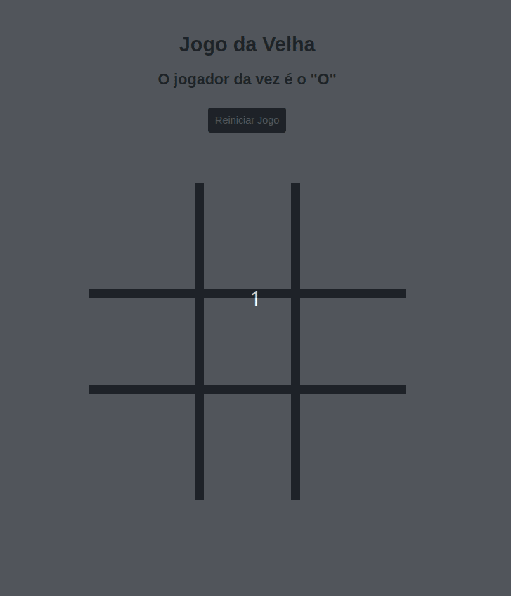

## Descrição

Projeto HTML, CSS e Javascript criado para a 1ª Oficina de Programação do Colégio Nacional/2024

## Como rodar o projeto

- Abra um terminal de comando na pasta onde deseja criar o projeto
- Clone o projeto com o comando abaixo

  `$ git clone https://github.com/FabianaMendes/jogo-velha-html.git`

- Clique com o botão direito sobre o arquivo HTML e escolha a opção "Abrir com o `navegador`"

## Tecnologias

Para conhecer mais sobre cada linguagem utilizada neste projeto, acesse as documentações abaixo:
- [HTML](https://www.w3schools.com/html/)
- [CSS](https://www.w3schools.com/css/)
- [Javascript](https://www.w3schools.com/js/)
